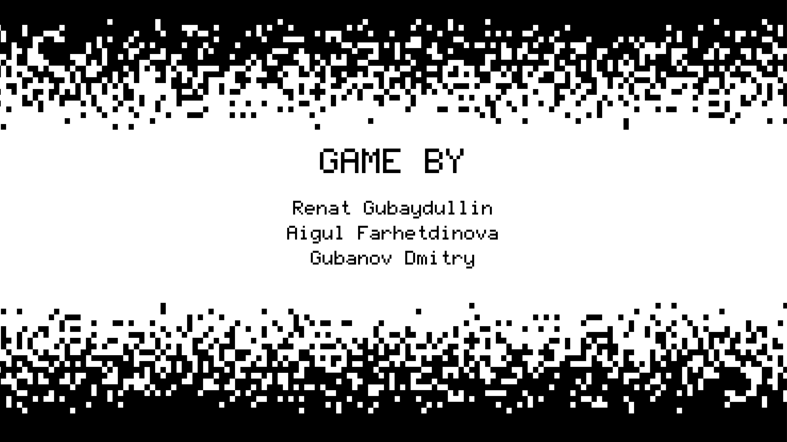
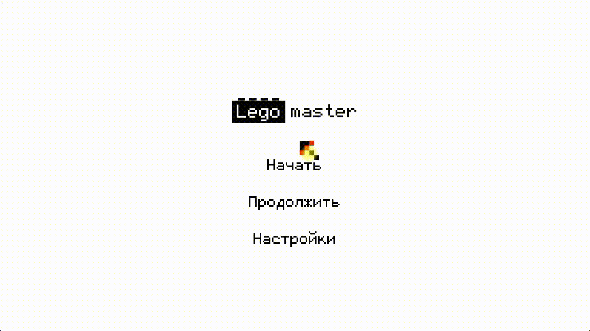
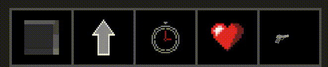

# Пояснительная записка:

- Заставка
    * Название
    * Разработчики

- Меню
    * Настройки
        * Размеры экрана
        * Громкость музыки и эффектов
        * Кнопка "Применить"
    * Лого
    * Начать
    * Продолжить

-Игра

* Жизни
* Блоки
* Таймер
* Инвентарь
* Бонусы
* Оружие

- Инвентарь
    * Блок
    * Бонус к прыжку
    * Бонус к скорости
    * Доп. жизнь
    * Оружие

## Файлы

* [main.py](https://github.com/renat2006/lego_master_and_student/blob/Renat/main.py)    
  ___Это основной файл, в нём происходит запуск игры и функций___
* [constants.py](https://github.com/renat2006/lego_master_and_student/blob/Renat/logic/constants.py)    
  ___Здесь хранятся основные переменные и константы, для удобного доступа из других файлов___
* [in_game_menu.py](https://github.com/renat2006/lego_master_and_student/blob/Renat/logic/in_game_menu.py)    
  ___Инвентарь___
* [load_image.py](https://github.com/renat2006/lego_master_and_student/blob/Renat/logic/load_image.py)     
  ___Загрузка изображений___
* [menu.py](https://github.com/renat2006/lego_master_and_student/blob/Renat/logic/menu.py)    
  ___Меню и настройки___
* [start_screen.py](https://github.com/renat2006/lego_master_and_student/blob/Renat/logic/start_screen.py)    
  ___Стартовый экран___
* [load_design.py](https://github.com/renat2006/lego_master_and_student/blob/Renat/load_design_level1.py)    
  ___Загрузка уровня___

## Классы

`File_viewer` - Класс для работы с файлами и конвертации **pptx** в **png**    
`Main_window` - Окно ввода темы   
`Window2` - Окно выбора шаблона    
`Window3` - Окно предпросмотра презентации    
`Generator` - Класс генерирования презентаций и записи информации в txt   
`CustomDialog`  - Класс c моделью диалогового окна 

## Библиотеки

___Все используемые библиотеки находятся в
файле [requirements.txt](https://github.com/renat2006/projet_ya_lc/blob/master/requirements/requirements.txt)___

* [PyQt5](https://pypi.org/project/PyQt5/)
  Используется для вывода графического интерфейса
* [wikipedia](https://pypi.org/project/wikipedia/)
  Википедия - это библиотека Python, которая упрощает доступ и анализ данных из Википедии
* [python-pptx](https://pypi.org/project/python-pptx/)
  python-pptx - это библиотека Python для создания и обновления файлов PowerPoint (.pptx).
